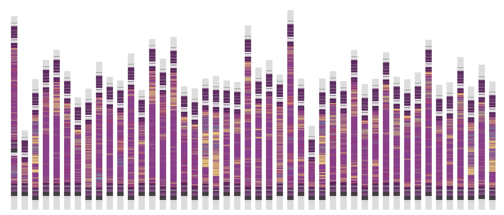
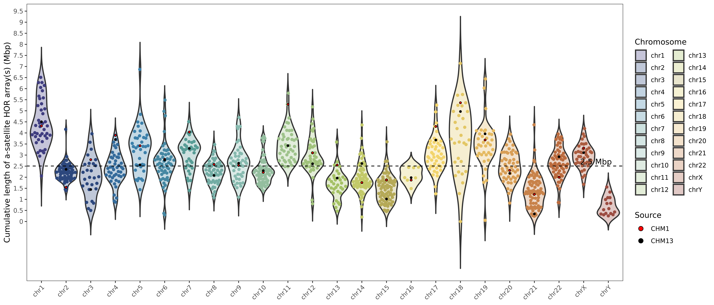

# `CenMAP`
[](https://github.com/logsdon-lab/hgsvc3/actions/workflows/main.yml)

A centromere mapping and annotation pipeline.

<table>
  <tr>
    <th>
      <figure float="left">
        
        <figcaption>chr12 centromere HOR structure.</figcaption>
      </figure>
    </th>
    <th>
      <figure float="left">
        
        <figcaption>Cumulative alpha-satellite HOR array lengths by chromosome.</figcaption>
      </figure>
    </th>
  </tr>
</table>

### Input
* `Verkko`/`hifiasm` genome assemblies
* PacBio HiFi reads used in the assemblies.
* A reference genome, ex. `CHM13`.

### Output
* A `bed` file with complete and correctly assembled centromeres.
* A `tsv` file with centromere alpha-satellite higher order repeat (HOR) array lengths.
* `RepeatMasker` repeat annotations and plots.
* `StainedGlass` sequence identity plots.
* `HumAS-HMMER` alpha-satellite HOR annotations and plots.

### Getting Started
`CenMAP` is implemented as a `Snakemake` pipeline and requires limited dependencies:
* `Python >= 3.7`
* `snakemake==7.32.4`
* `conda` / `mamba`
* `singularity`

Clone the repo and its submodules.
```bash
git clone git@github.com:logsdon-lab/CenMAP.git --recurse-submodules
```

Build a `conda` environment.
```bash
conda env create -f env.yaml --name cenmap
```

Modify `config/config.yaml` and test the pipeline.
```bash
snakemake -np -c 1 --configfile config/config.yaml
```

### Wiki
Read more on the `CenMAP` [wiki](https://github.com/logsdon-lab/CenMAP/wiki).
