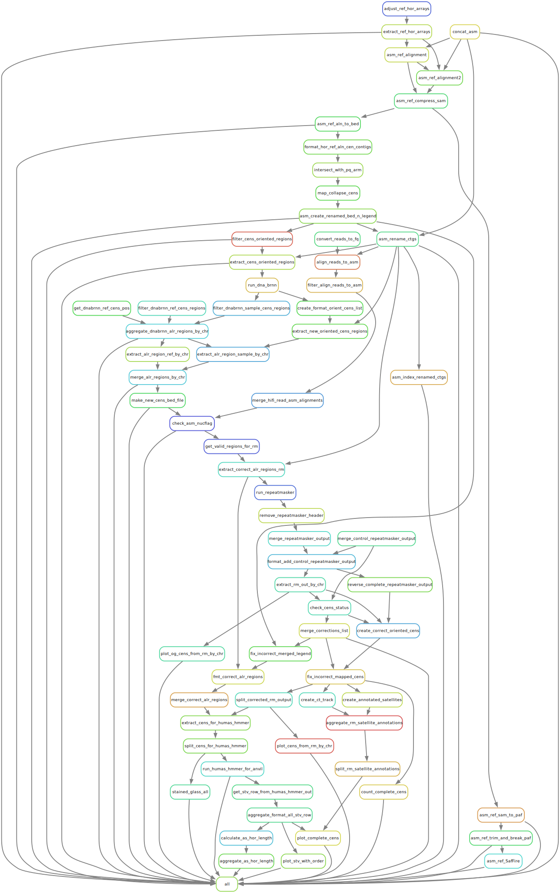

# HGSVC3
[](https://github.com/logsdon-lab/hgsvc3/actions/workflows/main.yml)
[](https://hub.docker.com/r/logsdonlab/hgsvc3)

Workflow for [HGSVC3](https://www.internationalgenome.org/human-genome-structural-variation-consortium/) centromere analysis. (WIP)



### Usage

#### Local
```bash
# NOTE: dna-brnn must be installed locally
snakemake --use-conda -np --configfile config/config.yaml
```

#### Cluster via `singularity`.
* Must be in project dir.

```bash
module load singularity
singularity pull docker://logsdonlab/hgsvc3:latest
```

```bash
max_mem=61440
num_cores=12

bsub -e hgsvc3.err -o hgsvc3.out \
-n $num_cores \
-M $max_mem -R "rusage [mem=$max_mem] span[hosts=1]" \
"./run_singularity.sh -np -c $num_cores"
```

### TODO
* Remove old bedminmax scripts. Only leaving in until output discrepancies finished.
