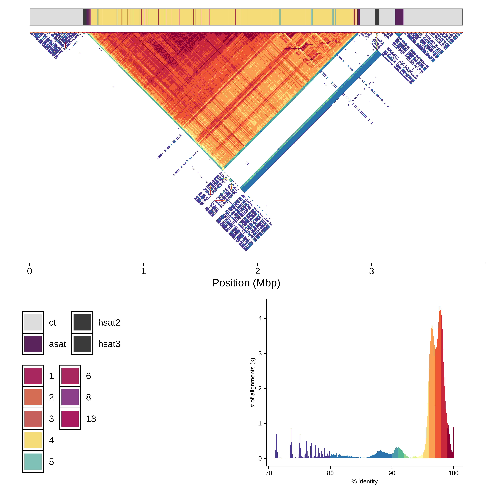

# `CenMAP`

A centromere mapping and annotation pipeline for T2T human genome assemblies implemented in [`Snakemake`](https://snakemake.github.io/).

<table>
  <tr>
    <td>
      <figure float="center">
        
        <figcaption>CHM13 chr2 centromere HOR structure and self-identity plot.</figcaption>
      </figure>
    </td>
    <td>
      <figure float="left">
        
        <figcaption>HGSVC3 chr12 centromere HOR structure.</figcaption>
      </figure>
      <figure float="left">
        
        <figcaption>HGSVC3 Cumulative alpha-satellite HOR array lengths by chromosome.</figcaption>
      </figure>
    </td>
  </tr>
</table>

### [Input](https://github.com/logsdon-lab/CenMAP/wiki/2.-Getting-Started#data)
* [`Verkko`](https://github.com/marbl/verkko) or [`hifiasm`](https://github.com/chhylp123/hifiasm) human genome assemblies
* PacBio HiFi reads used in the assemblies
* [`CHM13`](https://github.com/marbl/CHM13) reference genome assembly

### [Output](https://github.com/logsdon-lab/CenMAP/wiki/5.-Output)
* Complete and correctly assembled centromere sequences and their regions.
* Centromere alpha-satellite higher order repeat (HOR) array lengths.
* [`RepeatMasker`](https://www.repeatmasker.org/) and [`HumAS-HMMER`](https://github.com/enigene/HumAS-HMMER) alpha-satellite HOR monomer annotations and plots.
* [`ModDotPlot`](https://github.com/marbl/ModDotPlot) sequence identity plots.
* Combined sequence identity and HOR array structure plots.

### [Documentation](https://github.com/logsdon-lab/CenMAP/wiki)
Read the docs on the `CenMAP` [wiki](https://github.com/logsdon-lab/CenMAP/wiki).
