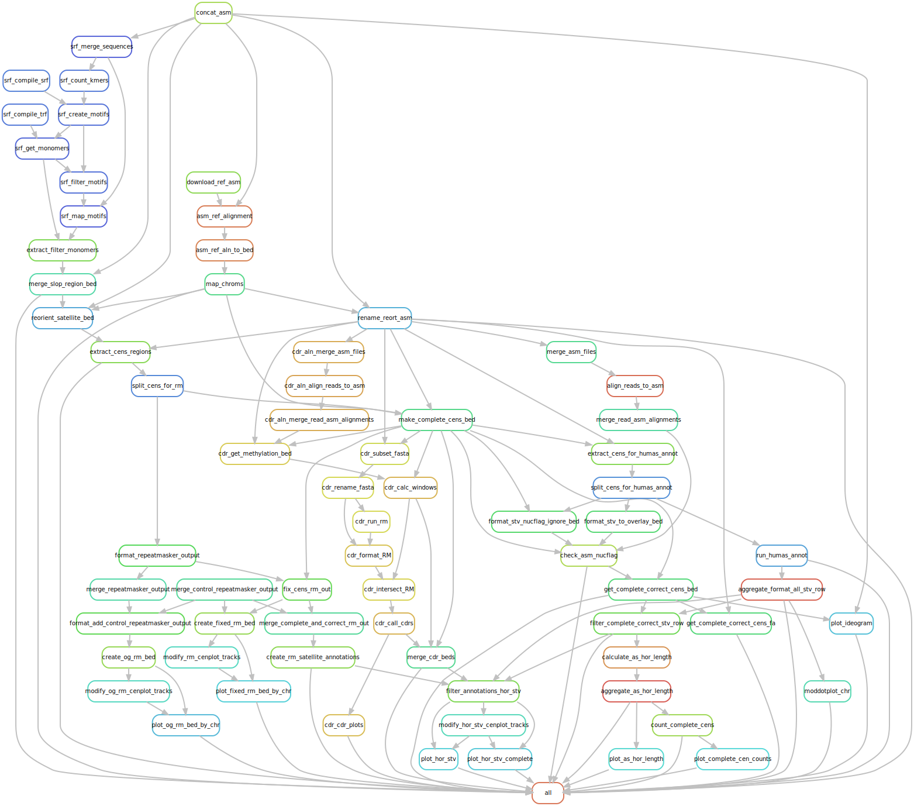

# HGSVC3
[](https://github.com/logsdon-lab/hgsvc3/actions/workflows/main.yml)
[](https://hub.docker.com/r/logsdonlab/hgsvc3)

Workflow for [HGSVC3](https://www.internationalgenome.org/human-genome-structural-variation-consortium/) centromere analysis. (WIP)



### Usage

#### Locally
```bash
# NOTE: dna-brnn must be installed locally
snakemake --use-conda -np --configfile config/config.yaml
```

#### Cluster via `singularity`.
* Must be in project dir.

```bash
module load singularity

singularity pull docker://logsdonlab/hgsvc3:latest
bsub < run_cluster.sh -n
```

#### Download raw data with `globus-cli`
Login and check your globus home endpt direcory. Directories specified below are local to this.
```bash
globus login
globus endpoint local-id
# C:\Users\koshima
```

To download files.
```bash
./workflow/scripts/globus_download_data.sh projects/hgsvc3/data/asm projects/hgsvc3/data/raw_data
```

### TODO
* Remove old bedminmax scripts. Only leaving in until output discrepancies finished.
