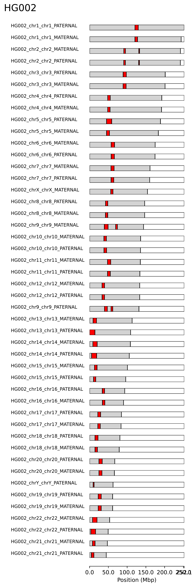

# `CenMAP`

A centromere mapping and annotation pipeline for T2T human and primate genome assemblies implemented in [`Snakemake`](https://snakemake.github.io/).

<table>
  <tr>
    <td>
      <figure>
        
         
        <figcaption>
          Chr1 α-satellite higher-order repeat structure, centromere dip regions, and self-identity plot
        </figcaption>
      </figure>
    </td>
    <td rowspan="2">
      <figure>
        
         
        <figcaption>Chr12 α-satellite HOR arrays</figcaption>
      </figure>
    </td>
    <td rowspan="2">
      <figure>
        
         
        <figcaption>Ideogram</figcaption>
      </figure>
    </td>
  </tr>
  <tr>
    <td>
      <figure>
          
           
          <figcaption>Cumulative α-satellite HOR array lengths</figcaption>
      </figure>
    </td>
  </tr>
</table>

### [Input](https://github.com/logsdon-lab/CenMAP/wiki/2.-Getting-Started#data)
* [`Verkko`](https://github.com/marbl/verkko) or [`hifiasm`](https://github.com/chhylp123/hifiasm) human genome assemblies
* PacBio HiFi reads used in the assemblies
* [`CHM13`](https://github.com/marbl/CHM13) reference genome assembly
* (Optional) Unaligned BAM files with 5mC modifications at CpG sites.

### [Output](https://github.com/logsdon-lab/CenMAP/wiki/5.-Output)
* Complete and correctly assembled centromere sequences and their regions validated by [`NucFlag`](https://github.com/logsdon-lab/NucFlag).
* Centromere alpha-satellite higher order repeat (HOR) array lengths via [`censtats`](https://github.com/logsdon-lab/CenStats).
* [`RepeatMasker`](https://www.repeatmasker.org/) and [`HumAS-SD`](https://github.com/logsdon-lab/Snakemake-HumAS-SD) alpha-satellite HOR monomer annotations and plots.
* [`ModDotPlot`](https://github.com/marbl/ModDotPlot) sequence identity plots.
* Combined sequence identity and HOR array structure plots via [`cenplot`](https://github.com/logsdon-lab/cenplot).
* (Optional) Centromere dip region (CDRs) with [`CDR-Finder`](https://github.com/koisland/CDR-Finder)

### [Documentation](https://github.com/logsdon-lab/CenMAP/wiki)
Read the docs on the `CenMAP` [wiki](https://github.com/logsdon-lab/CenMAP/wiki).

### [Tests](https://github.com/logsdon-lab/CenMAP/wiki/6.-Test)
To run tests, refer to the wiki [page](https://github.com/logsdon-lab/CenMAP/wiki/6.-Test).
